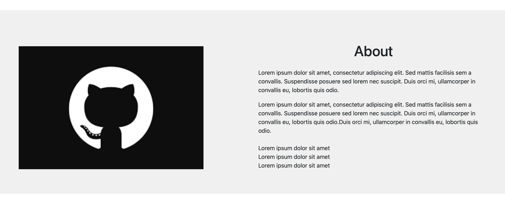

# Lisa Harrison

## Website: Portfolio 
Welcome to my current 'work in progress' portfolio site - site to be deployed soon...

Portfolio includes navigation between the different information sections. 
Navigation bar provides option to link to external pages.
The contact form allows visitors to register their interest.
* Form to be linked to email.
Profile links to profile pages of sites included.

### Website 
For reference, see the ["Screenshots" section](#screenshots) below.

The website consists of 4 navigation links:
*Profile Links: Included are links ro freeCodeCamp, GitHub, Tableau & LinkedIn
*Portfolio
*About
*Contact

* Section 1: Page navigation and header [header](#nav-header) 

* Section 2: Project Portfolio [portfolio](#portfolio)

* Section 3: About section [about-section](#about-section)

* Section 4: Contact Form [contact](#contact-form) 

* Section 5: Profile Links [profile](#profile-links) 

### Screenshots

This section contains screenshots of example pages built. 

#### 

Navigation:

#### 

Portfolio:

#### 

About Section:

#### 

Contact Form:

#### 

Profile Links:

### Credits

The JavaScript library (particles.js) used for the first section of this website was sourced from VincentGarreau. This project does not claim any ownership or credit over the javascript library used. Link to the project here:https://github.com/VincentGarreau/particles.js/

